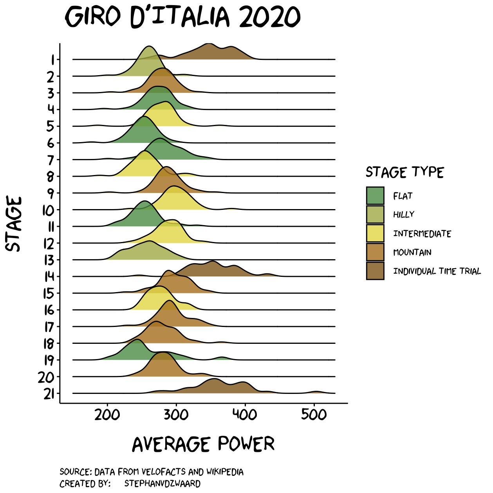

# Giro2020
Visualization of the Giro d'Italia 2020

---

This repository contains data obtained by [velofacts](https://twitter.com/velofacts) related to the power output during Giro d'Italia stages.

Stage types were scraped from [Wikipedia](https://en.wikipedia.org/wiki/2020_Giro_d'Italia).

The script to create the data visualization of the Giro 2020 can be found in the `scripts` folder. 

---

### Data Visualization

Power output distribution per stage (density plot)

 

